# 状态表

## 任务倍率

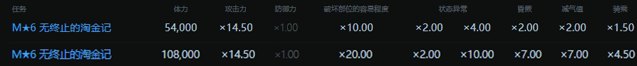

## 部位

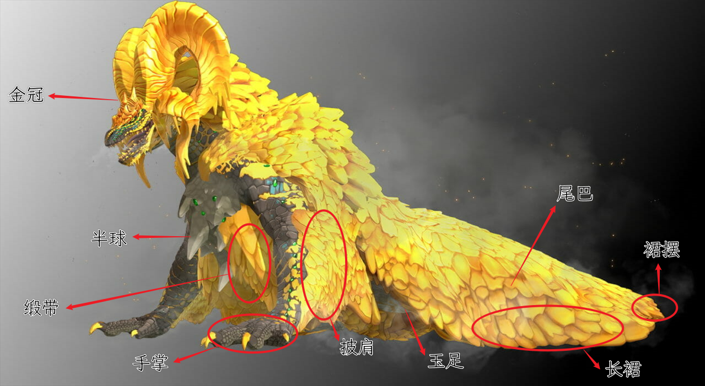

## 肉质与耐性

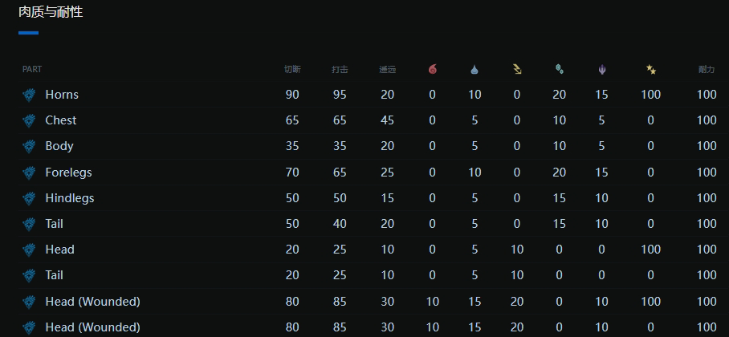

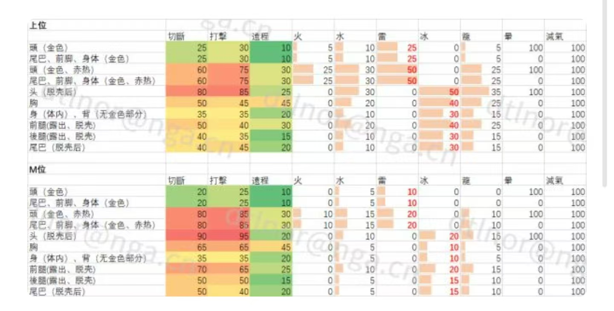

## 部位生命值

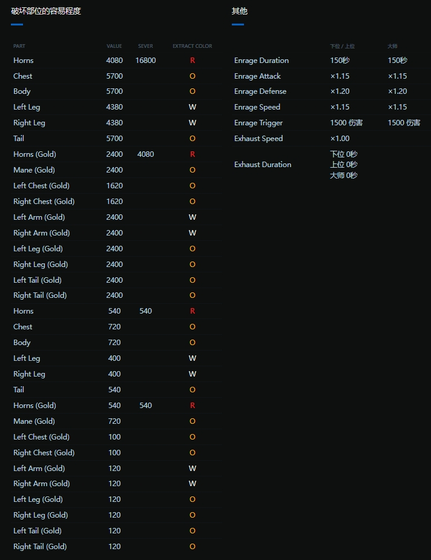

## 状态异常

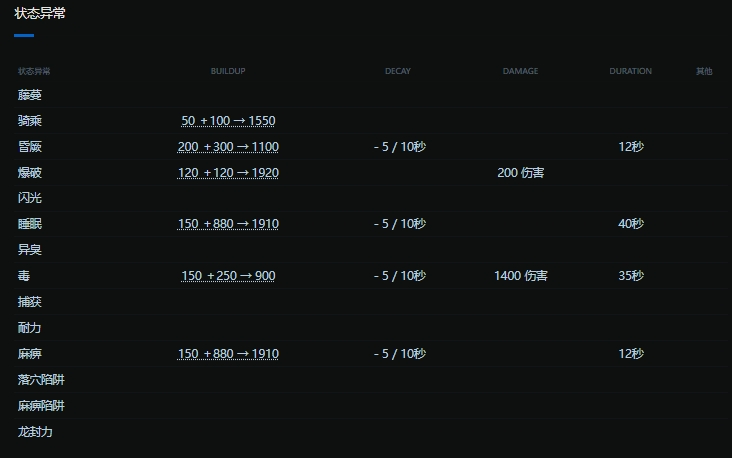

初始+叠加→最大

# 绚辉龙各阶段

**高冷态**：P1一阶段，暗黄色的金属包裹，全身大部分肉质很差。
**炽热态**：P1二阶段，身上黄金变明亮，肉质超好。
**解放态**：P1 -> 2 。褪去外衣，露出肢体
**暴怒态**：P3特有，在最后一区进怒，呈现为站立喷火，此时免疫投射物以及弹系伤害。
P1 -> 2 ：血量70%~65%，最低64%
P2 -> 3 ：血量40%~35%，最低34%

*每个区域从见面开始，只有6分钟的战斗时间*

# 炽热态

## 温度计理论

对于绚辉龙从高冷态转变为炽热态的条件，本作者认为是有一个统一的值，暂且称之为“温度计”。该温度计的主条件为单位时间内所受到的伤害，即DPS（Damage Per Second），还搭配有火属性武器伤害和骑乘的额外因素。至于npc提示的击打胸部更能加快软化肉质，则是倍率后计入到升温值上。

## 测试前提

大师六星活动“无止尽的淘金热”，单双人非怒无软百会

## DPS

若绚辉龙持续受到至少48dps的伤害（类似于第一刀开始，意即正常dps要求还会更低），将会在刚低于88%时转入炽热态。

### 胸部

进炽热态，纯打手掌需要降低至88%以下，而纯打胸则是到92%。

即，手6480，胸4320，以6480算为温度计满条，则胸部收到伤害*1.5才是蓄到温度计上升的部分。

### 温度计部位倍率表（满条为6480）

| 部位 | 胸部 | 手掌 | 胸甲 | 大角、大角金 | 背甲、手甲、裙摆、尾甲 |
| :--: | :--: | :--: | :--: | :----------: | :--------------------: |
| 倍率 | 1.5  |  1   |  2   |     0.5      |          0.2           |

## 火伤

#### 作用方式

首先绚辉龙在高冷态的火吸收为0，火盾斧超解到甲上为0，就算剑蓄力二连打手掌，也全是物理伤害，这说明是检测火伤，不是受到火伤。另外可燃石与火笛子演奏音波，都无法计入升温，意即不是单纯检测武器属性是否为火，而是招式伤害中要附带有火属性。

#### 武器种类升温倍率测试

有人提及是否与煌黑龙炸膛相似，测试下无论是大剑飞身跃入斩、拔刀蓄力，还是盾斧剑的蓄力二连或是双刀，统一结果为92%，说明无关。

#### 持续性测试

分别是黑双和皇金火双，先用其中一套打至左边的血线，再换另一套打至炽热态。以下数字省略%，误差在±0.1%

| 黑-火     | 差值 | 火-黑     | 差值  |
| --------- | ---- | --------- | ----- |
| 100 - 92  | ≈8   | 100 - 88  | ≈12   |
| 98 - 91.5 | ≈6.5 | 98 - 88   | ≈10   |
| 96 - 90.5 | ≈5.5 | 97 - 89   | ≈8    |
| 94 - 90   | ≈4   | 96 - 90   | ≈6    |
| 92 - 89.5 | ≈2.5 | 95 - 91   | ≈4    |
| 91 - 89   | ≈2   | 94 - 91.5 | ≈2.5  |
|           |      | 93 - 92   | **1** |

说明不是一直检测是否有火伤，应该满足一定伤害这个条件。而其中的第4行数据，刚好是黑双打6%，火双打4%的配对情况。

#### 叠加测试

在保持上述条件下，用火刀纯胸，将在95%就进入炽热态

## 骑乘

在100-95%会有4次挣扎，会在第二次进入炽热态；在95-88%，则会减少为3次，在一次挣扎后进入炽热态。

## 注意

即便温度计到达沸腾点可以转阶段，若无可锁定的玩家，（猫和猫大盾都拉不了仇恨），则进入索敌而不会转炽热态

# 暴怒态

## 转态条件

三拍，在通道可以实现二撞。

除去正常的拍撞，还有受到600点以上的伤害时也会进入暴怒态

暴怒态动画时锁硬直，免疫远程伤害（包括武器和投射器），暴怒后投射器硬直只能生效一颗

## 动作拆解

正常情况，暴怒是从右往左，然后一发随机的直线火，地火会逐渐扩张，一般会到脚后跟再过一个身位的范围。

但也有只烧到后脚脚趾的情况。这是因为一般的墙会把火隔回来，但是中间的钢管舞和两面对角上可攀爬的墙却是吸火的。

最简单的触发情景：在通道就满足进怒条件，然后钩爪挂在龙上，或者提前跑下去，绚辉龙就会在第一时间固定位置进怒，那个位置的左边刚好是中间的钢管，可以吸掉大部分的地火。

## 滴落岩浆（待测）

有位置是固定掉落的，比如下滑坡右边爬墙前。

# 钢管舞（待定）

触发条件，推测因素有血量、时间、连段，目前测的最快39%54s10招，最慢8%144s23招，从进入暴怒态开始计时，感觉和煌黑一样有连段，但是也不排除还有血量和时间等多种判定

# 硬直

富婆的硬直分两类：积累硬直和失衡硬直。

### 积累硬直

骑乘、晕眩、口水、睡眠、麻痹、头破。

### 失衡硬直

肢体、站立、投射物、落石

### 相关名词

**硬直循环**：在头部和四肢上，正常自由态时，打完一次部位生命值，表现出的硬直为胆怯-倒地-胆怯-倒地的循环

**爆条**：打完一次部位生命值，不出硬直表现，溢出的部分算入下个硬直条，但顺位保持不变

**正结**：打完一次部位生命值，会出当前硬直表现

## 积累硬直

### 眩晕

姿势为侧躺，头上会有小星星在转。

部分武器具有打击系伤害的招式，例如大剑的横拍等，积累量非常少，可以忽略不记，榴弹也不再多讲。

正常要考虑到出晕的只有三把：大锤、笛子、超解盾斧，在多人时需至少配二击晕的强打衣。

撞墙一次积累1/8的眩晕值，二撞就有1/4了，在控晕时需要纳入考量。

期间不锁硬直与破坏，爆条

### 麻痹

正常出招或者大倒地时触发，四肢岔开，头放低且小幅动。在侧倒时触发，则会维持当前姿势。

期间不锁硬直与破坏，爆条

### 睡眠

姿势为侧躺，往龙的左手边躺下，最后角大概在站立时手的位置。起来后会伸懒腰。

p3怒后眠会重新进一次暴怒动画。

期间不锁硬直与破坏

### 头破

**金冠**：被黄金包裹，只能在P1击破，击破后会掉落大块黄金，绚辉龙巨久倒地，姿势为趴倒。

期间不锁硬直,破坏只锁大角,会爆条。

**带角**：先是破坏大角的一部分，出一次胆怯，然后才是完全破坏，会掉落大角，绚辉龙出一段翻身动画。

### 口水

口水的本质是积累够伤害后，替换掉一次非倒地的硬直。

口水期间不锁硬直与破坏，会爆条

### 骑乘

## 失衡硬直

### 肢体

#### 四肢

一侧手脚积累够伤害后，先会有一次胆怯，然后再积累够伤害就会倒地。手脚共用一次硬直，左右边分开。姿势为侧躺。

倒地期间不锁硬直与破坏，爆条

### 头部

同上，倒地姿势为趴倒

#### 尾巴

破坏时会有一次胆怯

### 站立

富婆有很多不是四肢着地的招式，p1大压、p2及p3怒前的蓄力大拍、p3泰山压顶、站立孕吐、龙车、侧靠。在其不是四肢着地的时候打出硬直（口水或投射物、刺客衣扔烟进紫圈）就会倒，姿势为趴倒。

倒地期间不锁硬直与破坏，爆条。如果打出的硬直原本为四肢侧躺，则会替换为趴倒，期间不锁硬直与破坏，爆条

*若富婆在完全站立前被打出硬直，则会出当前硬直而不是大倒地。*

### 落石

环境陷阱，p2独有。姿势为趴倒。

若落石下落时对绚辉龙造成非部位破坏或部位硬直，则不趴倒，而是被相对应的部位硬直表现形式覆盖。

击中倒地后锁大角破坏值，锁眠麻晕，不锁肢体硬直，会爆条。

### 投射物

投射物硬直和四肢的第一次硬直一样，都是胆怯，即短时的小硬直。

在非自由态，富婆会把投射器硬直存储起来。常见的三种应用为：为暴怒态垫硬直、倒地即便扔出了超过4颗，甚至多达8颗，都会在恢复自由态后受到投射器硬直的影响、用全弹发射来代替非自由态下的投射器硬直铺垫。

但全弹发射的方式并不稳定。例如可燃和灭龙发射后，会在原地留下一团粉尘，要爆炸到龙身上才算叠加一次硬直。

倒地期间不锁硬直与破坏，正结

#### p1p2p3暴怒前

4发投射物一次硬直。

得是掉落物（可燃石、尖锐石、黏着石、灭龙石）才行，地图上有的石头和爆裂结晶不行。和愤怒状态无关（好吧，还是有点关系），和该区域投射物导致的硬直次数有关。
第1、2次硬直都是4发，第三次就需要9~21发。不知道为什么有时得要21发才出，推测某些招式例如翻滚吞了硬直积累。
如果怒前已经出了两次投射物硬直，拍怒后会降低出硬直所需的投射次数。一般第三次都在13~15发之间，而如果是发怒下的第三次则会减少次数。
*换区之后会重置已积累的投射物硬直次数，会继承已垫的硬直。*

#### 暴怒态

自由态或硬直下扔3颗，硬直状态下第4颗（如口水、倒地、换区锁硬直状态），扔第5颗才会生效。

*投射物对于泰山压顶只会出胆怯，不会倒地*

# 骑乘

## 前情

[御龙奥术演示片段](https://www.bilibili.com/video/BV1YPCkYpEbA/)

富婆只有上半身能够积累骑乘值，其中打击头部可以积累最多

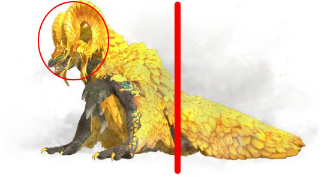

富婆在不提前出硬直的情况下，骑乘倒地的地方是固定的。

## p3

打红×的地方，对角线上，两个可以攀爬的柱子

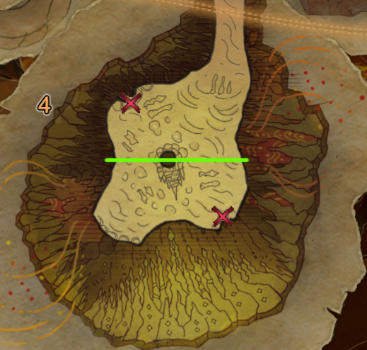

众所周知，p3骑乘上后，会先跑去距离更远的柱子撞第一次，然后会在另一个柱子撞第二次，接着进骑乘终结。

关键就在于骑乘终结前的这次撞墙，你当时所处的部位将决定倒地的位置。
更具体的说，是在撞墙动作前，表现为屏幕边缘刚冒光，在头还是在背，决定了头部距离墙壁的远近。

**背：**

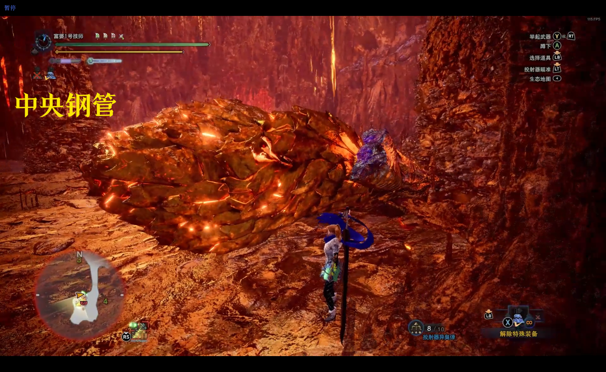

**头：**

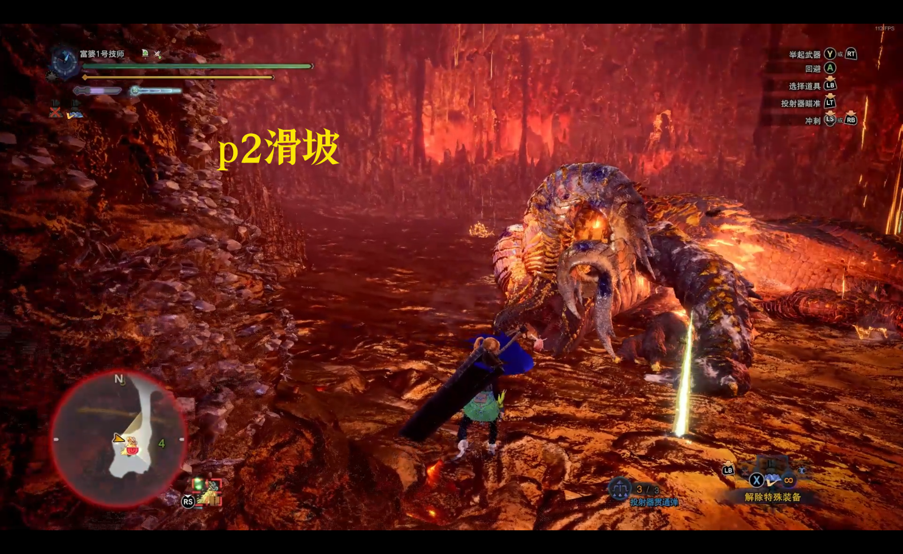

## p2

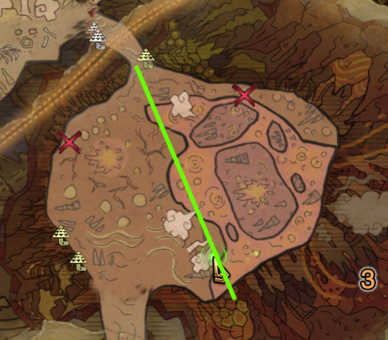

面朝p2区域方向分左右。也就说现在屏幕图片的左边，在下面的描述则为右边。

p2沿着通道延长线大致分为左右两边，同样是撞墙两次后进入骑乘终结。
但与p3的换边不同，p2的两次撞一般都在同边（特殊情况一会讲）。

**右背背**

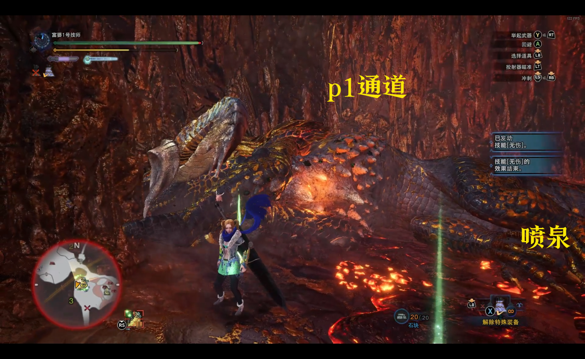

**左背背**

**左头头**

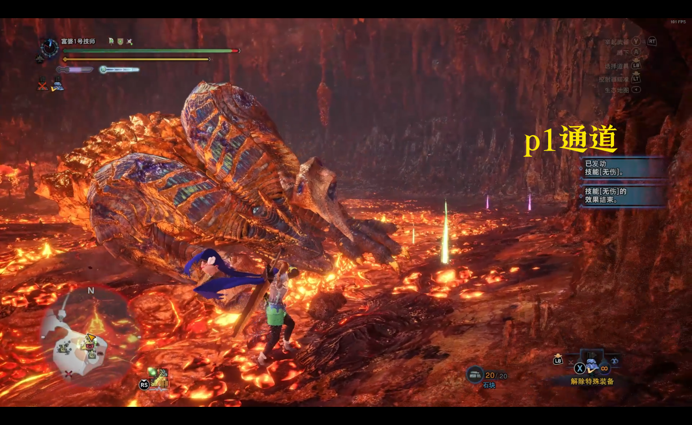

**右头头**

特例，往右边撞完第一次，如果移动到头上，就会触发换边。在左边却不会触发。

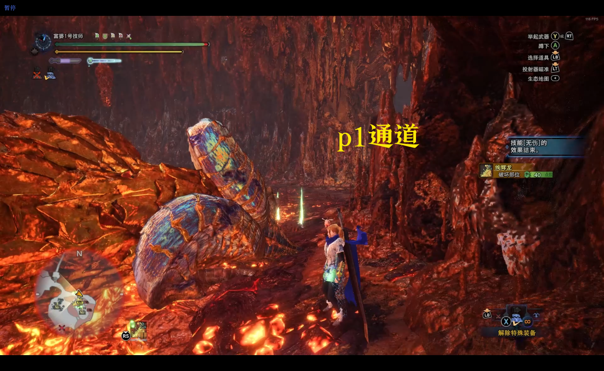

## p1

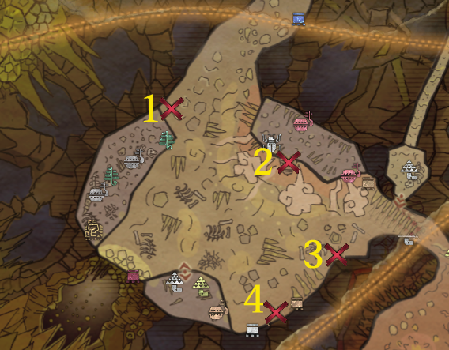

**位置1**

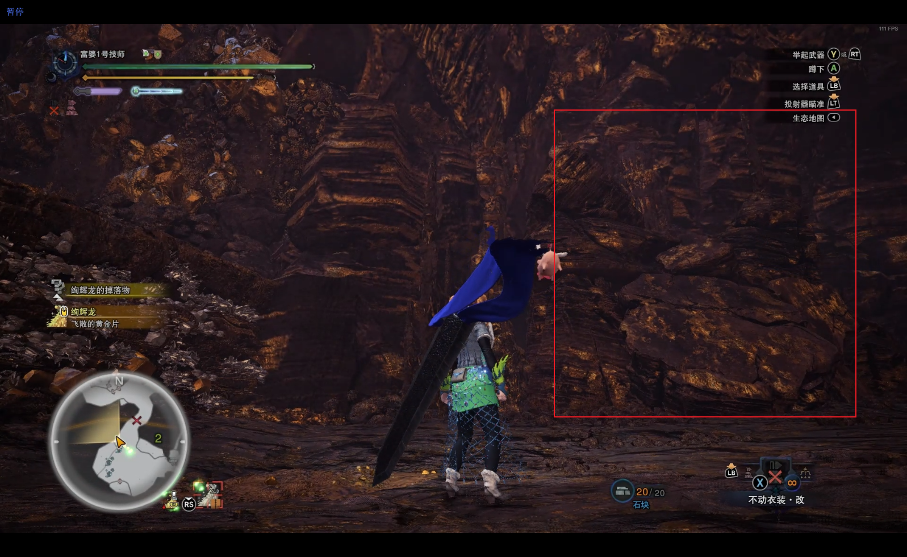

**位置2**

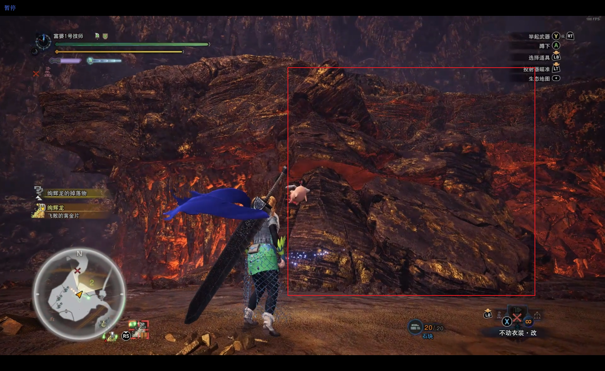

**位置3**

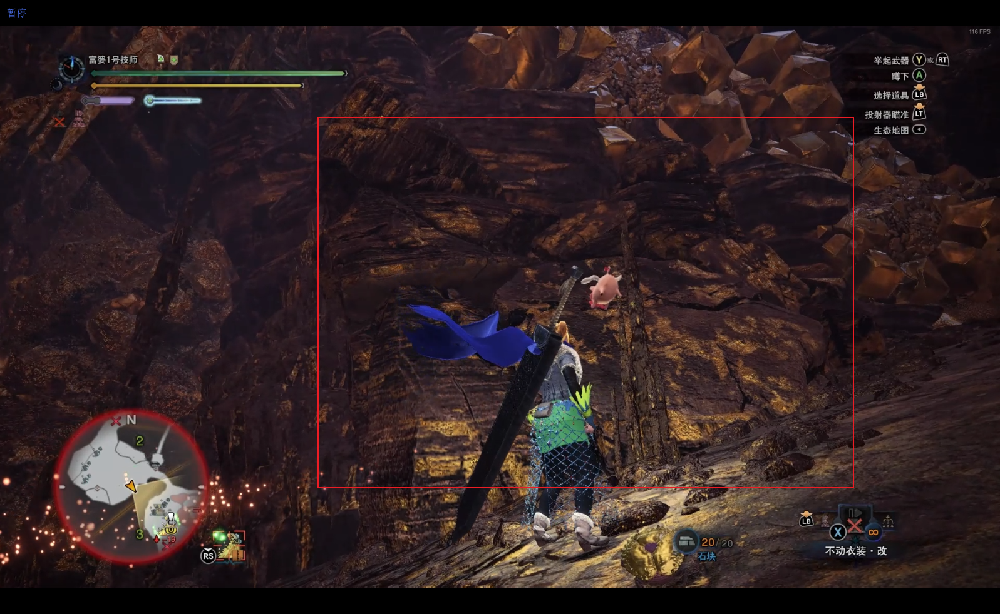

位置4

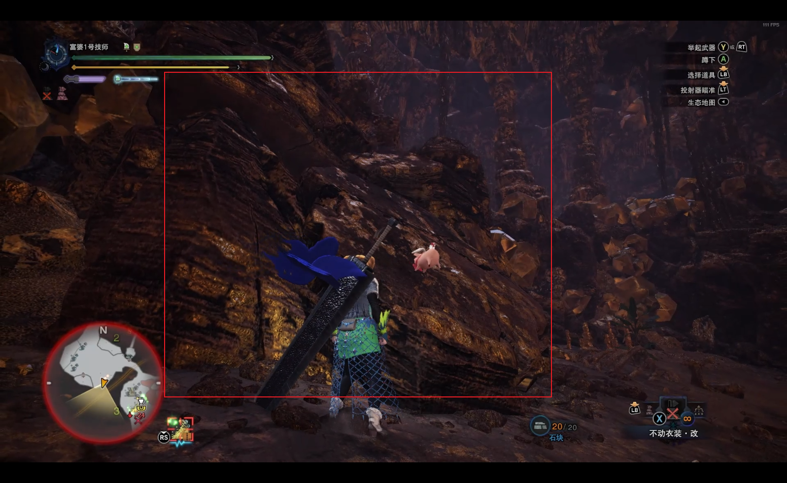

其实就是有这种堆叠起来的岩石的地方，绚辉龙会选择其中两个作为撞墙的目标。

### 挣扎次数因素

p1的复杂体现在有4次挣扎，在100-95%会有4次挣扎；在95-88%，则会减少为3次。最后两次依然为撞墙，在炽热态骑乘，会直接进入撞墙阶段。

### 升温挣扎

把炽热态前的这次关键挣扎就叫升温挣扎吧。

在撞墙前的两次挣扎前，都会先进行一次随机方向的转身，如果在转身时就出了硬直，取消了升温挣扎，则绚辉龙不会提前进入炽热态。而只要升温挣扎开始，何时打断都能够进入炽热态。

### 挣扎形式

在头时，原地头槌；在背时，一次幅度很大的猛烈摆身。

# 黄金乡部分

## 可利用的环境

2区：斜坡、高台、楔虫
3区：落石、熔岩、台阶
4区：中间柱子、边缘对角的墙
还有换区的那两斜坡

## 轮换时间

持续2星期，并在周五早上8点交接

# 参考文献

[1] : [kiranico](https://mhworld.kiranico.com/zh/monsters/5xbCn/xuan-hui-long)

[2] : 怪物猎人世界吧

[3] : [**【MHWI】苍蓝星笔记——任务选择——特别调查——绚辉龙**](https://www.bilibili.com/opus/830059213725106232?spm_id_from=333.999.collection.opus.click)

[4] : [**MHW绚辉龙机制内存计算原理**](https://www.bilibili.com/opus/357711015587865191)